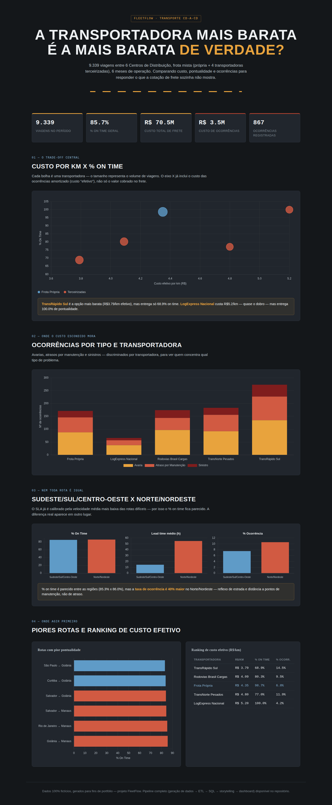
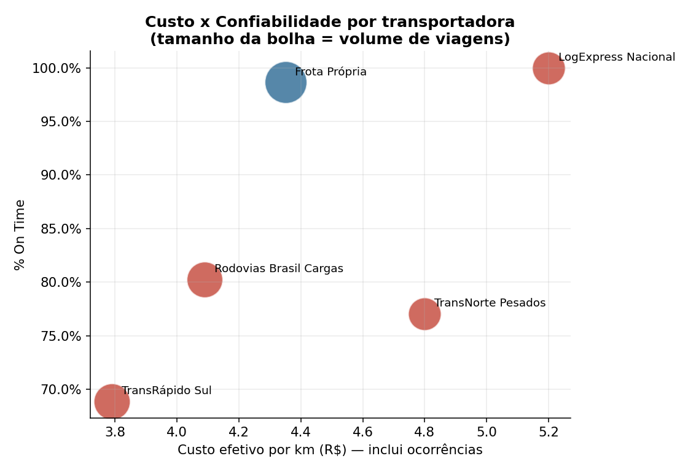
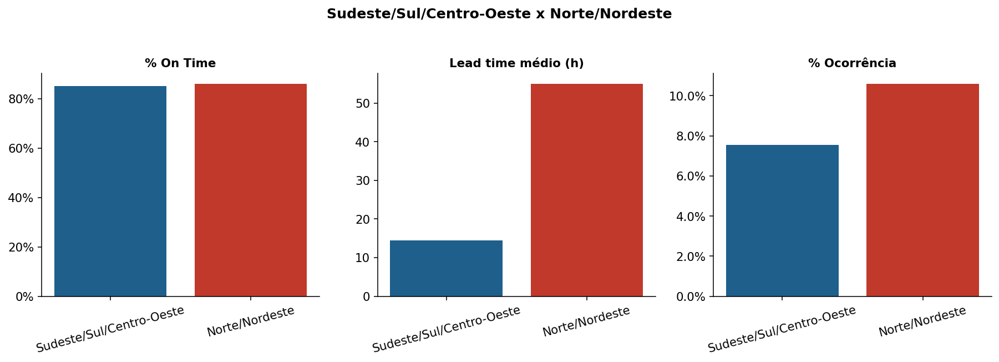

# 🚛 FleetFlow — Custo x Confiabilidade no Transporte CD-a-CD

**Análise logística de transporte entre Centros de Distribuição (rotas longas), comparando transportadoras e regiões para responder: a opção mais barata é a mais barata de verdade?**

---

## Índice

1. [Visão geral](#visão-geral)
2. [O problema de negócio](#o-problema-de-negócio)
3. [Storytelling: custo x confiabilidade](#storytelling-custo-x-confiabilidade)
4. [Principais resultados](#principais-resultados)
5. [Dashboard](#dashboard)
6. [Screenshots](#screenshots)
7. [Arquitetura da solução](#arquitetura-da-solução)
8. [Stack tecnológica](#stack-tecnológica)
9. [Estrutura do repositório](#estrutura-do-repositório)
10. [Base de dados](#base-de-dados)
11. [Pipeline de ETL](#pipeline-de-etl)
12. [Modelagem SQL](#modelagem-sql)
13. [Metodologia de análise](#metodologia-de-análise)
14. [Como rodar localmente](#como-rodar-localmente)
15. [Decisões técnicas e aprendizados](#decisões-técnicas-e-aprendizados)
16. [Limitações](#limitações)
17. [Melhorias futuras](#melhorias-futuras)
18. [Sobre a autora](#sobre-a-autora)
19. [Licença](#licença)

---

## Visão geral

O **FleetFlow** simula 6 meses de operação de transporte rodoviário entre
**6 Centros de Distribuição** (rotas longas, CD a CD), com uma frota
mista: **1 frota própria + 4 transportadoras terceirizadas**. O projeto
cobre o ciclo completo — geração da base → ETL → modelagem em SQL →
análise com storytelling → dashboard interativo.

Diferente dos outros projetos do portfólio (que comparam "antes x
depois"), aqui o recorte é **comparativo**: transportadoras entre si, e
regiões estruturalmente mais fáceis contra mais difíceis de operar. A
pergunta não é "melhoramos?", é **"estamos pagando pelo serviço certo?"**

> Todos os dados são fictícios, gerados programaticamente para fins de
> portfólio — não representam nenhuma empresa real.

## O problema de negócio

Em operações logísticas com frota mista, a decisão de qual transportadora
usar costuma ser guiada pelo **preço por km cobrado** — a proposta mais
barata "ganha" a rota. O problema é que essa comparação ignora um custo
que só aparece depois: **avarias, atrasos por manutenção e sinistros**,
que têm custo financeiro direto e não entram na cotação de frete.

Da mesma forma, quando uma rota tem desempenho pior, é comum assumir que
"a transportadora é ruim" — sem separar o que é responsabilidade da
transportadora do que é dificuldade estrutural da própria rota (estradas
piores, distância a pontos de manutenção, tempo de viagem mais longo).

**Pergunta de negócio respondida:**
> A transportadora mais barata por km é realmente a opção mais barata —
> e o que de fato diferencia o desempenho entre regiões: a
> transportadora que opera nelas, ou a rota em si?

## Storytelling: custo x confiabilidade

**1. Custo não é só o valor por km cobrado.**
A **TransRápido Sul** tem o menor custo por km cobrado (R$ 3,40), mas
soma R$ 1,23 milhão em ocorrências no período. Dividindo esse custo pelo
total de km rodados, o **custo efetivo** sobe para R$ 3,79/km. Continua
sendo a opção mais barata do grupo — mas em troca de **68,9% de
pontualidade**, a pior taxa entre as 5 transportadoras, e **14,5%** de
viagens com alguma ocorrência.

Do outro lado, a **LogExpress Nacional** custa R$ 5,20/km efetivo — quase
o dobro — mas entrega **100% de pontualidade** e a menor taxa de
ocorrência do grupo (4,2%). A decisão não é "qual é mais barata", é **"o
que a operação está disposta a pagar por confiabilidade"**: para cargas
urgentes ou de alto valor, o prêmio de preço se paga sozinho evitando o
custo — e o risco reputacional — de atrasos e sinistros.

**2. Região difícil não significa necessariamente atraso — mas significa
mais ocorrência.**
Comparando rotas que passam por Norte/Nordeste contra as demais, o % on
time é parecido (85,3% x 86,0%) — porque o SLA já é calculado
considerando a velocidade média mais baixa dessas rotas. Mas a **taxa de
ocorrência é 40% maior** no Norte/Nordeste — reflexo de estradas,
distância a pontos de manutenção e maior desgaste da frota nessas
condições. A rota com pior pontualidade da malha, aliás, é **São Paulo →
Goiânia** (83,1%) — nem sequer uma rota "difícil" por região, reforçando
que o problema real está concentrado em rotas específicas, não
distribuído igualmente.

**3. O custo real das ocorrências.**
No total, avarias, atrasos por manutenção e sinistros somaram **R$ 3,49
milhões** em 6 meses — um custo que não aparece em nenhuma cotação de
frete, mas que impacta diretamente a margem da operação.

📄 Relatório completo: [`analysis/storytelling.md`](analysis/storytelling.md)

## Principais resultados

| Transportadora | Tipo | Custo efetivo/km | % On Time | % Ocorrência |
|---|---|---|---|---|
| TransRápido Sul | Terceirizada | R$ 3,79 | 68,9% | 14,5% |
| Rodovias Brasil Cargas | Terceirizada | R$ 4,09 | 80,3% | 9,5% |
| Frota Própria | Própria | R$ 4,35 | 98,6% | 6,8% |
| TransNorte Pesados | Terceirizada | R$ 4,80 | 77,0% | 11,9% |
| LogExpress Nacional | Terceirizada | R$ 5,20 | 100,0% | 4,2% |

| Indicador geral | Valor |
|---|---|
| Total de viagens (6 meses) | 9.339 |
| % On Time geral | 85,7% |
| Custo total de frete | R$ 70,5 milhões |
| Custo total de ocorrências | R$ 3,49 milhões |
| Ocorrências registradas | 867 |

## Dashboard

Dashboard web interativo (HTML/JS + Chart.js), com identidade visual
própria de logística/rodovia. Traz o gráfico de bolhas custo x
confiabilidade, ocorrências por tipo e transportadora, comparativo
regional, ranking de piores rotas e de custo efetivo — com insights
escritos dinamicamente a partir dos dados.

Abra [`dashboard/index.html`](dashboard/index.html) em qualquer
navegador (não precisa de servidor).

## Screenshots

**Visão geral do dashboard**



**Custo x Confiabilidade por transportadora**



**Comparativo Sudeste/Sul/Centro-Oeste x Norte/Nordeste**



## Arquitetura da solução

```
generate_data.py  →  data/raw/*.csv
                          │
                          ▼
              automation/pipeline.py (ETL)
        extract → validate → transform → load
                          │
                          ▼
                data/processed/*.csv ──────────┐
                          │                     │
                          ▼                     ▼
                sql/ (PostgreSQL)      analysis/ (storytelling)
                tables → views → kpis   gráficos + relatório
                          │                     │
                          └─────────┬───────────┘
                                    ▼
                      dashboard/index.html (HTML + Chart.js)
```

A modelagem em SQL e o pipeline em Python calculam os **mesmos KPIs de
forma independente**, validados um contra o outro (ver seção
[Decisões técnicas](#decisões-técnicas-e-aprendizados)) — zero
divergência entre as duas camadas.

## Stack tecnológica

| Camada | Tecnologia |
|---|---|
| Geração de dados | Python (pandas, numpy) |
| ETL | Python (pandas), orquestração própria |
| Banco de dados | PostgreSQL |
| Análise e storytelling | Python (pandas, matplotlib) |
| Dashboard | HTML + CSS + JavaScript (Chart.js) |
| Versionamento | Git / GitHub |

## Estrutura do repositório

```
fleetflow/
├── scripts/
│   └── generate_data.py         # Gera a base fictícia (dados brutos)
├── automation/                   # Pipeline de ETL
│   ├── extract.py
│   ├── validate.py
│   ├── transform.py
│   ├── load.py
│   └── pipeline.py               # Orquestra o ETL completo
├── sql/                           # Modelagem em PostgreSQL
│   ├── tables.sql
│   ├── load.sql
│   ├── views.sql
│   └── kpis.sql
├── analysis/                      # Análises e storytelling
│   ├── analise_storytelling.py
│   ├── storytelling.md           # Relatório narrativo comparativo
│   └── figuras/                   # Gráficos gerados
├── dashboard/                      # Dashboard interativo (HTML/JS)
│   ├── index.html
│   └── preview.png
└── data/
    ├── raw/                        # Dados brutos gerados
    └── processed/                  # Dados após o ETL
```

## Base de dados

Todos os dados são **fictícios**, gerados via script Python, com perfis
distintos de custo/confiabilidade/ocorrência por transportadora e
diferentes níveis de dificuldade estrutural por região — para sustentar
a comparação central do projeto.

| Tabela | Linhas | Descrição |
|---|---|---|
| `centros_distribuicao` | 6 | CDs em 5 regiões (São Paulo, Rio de Janeiro, Curitiba, Salvador, Goiânia, Manaus) |
| `rotas` | 12 | Pares de CD (long-haul), com distância e tempo estimado |
| `transportadoras` | 5 | 1 frota própria + 4 terceirizadas, cada uma com perfil de custo/confiabilidade/ocorrência |
| `veiculos` | 150 | Frota distribuída entre as 5 transportadoras (Truck, Carreta, Bitrem) |
| `viagens` | 9.339 | Tabela fato principal — uma linha por viagem |
| `ocorrencias` | 867 | Avarias, atrasos por manutenção e sinistros vinculados às viagens |

## Pipeline de ETL

ETL modular (`automation/`), orquestrado por `pipeline.py`:

1. **Extract** — lê as 6 tabelas brutas com tipagem correta.
2. **Validate** — checa nulos, duplicados, integridade referencial e
   intervalos válidos. Roda sem nenhum problema de qualidade na base
   atual.
3. **Transform** — enriquece as viagens (merge com rota, transportadora,
   CDs de origem/destino), calcula atraso em horas, e gera três tabelas
   de KPI comparativo: `kpis_transportadora`, `kpis_regiao` e
   `kpis_rota`.
4. **Load** — salva as tabelas processadas em `data/processed/`.

```bash
python automation/pipeline.py
```

## Modelagem SQL

Schema físico completo em PostgreSQL (`sql/tables.sql`), com chaves
estrangeiras, checks de domínio e índices de apoio. As views
(`sql/views.sql`, `sql/kpis.sql`) replicam **a mesma lógica de
agregação do pipeline Python** — validadas linha a linha, com
**divergência zero** em todos os indicadores.

```bash
psql -d fleetflow -f sql/tables.sql
psql -d fleetflow -f sql/load.sql
psql -d fleetflow -f sql/views.sql
psql -d fleetflow -f sql/kpis.sql
```

## Metodologia de análise

O custo "efetivo" por km de cada transportadora soma o custo de frete e
o custo das ocorrências que ela gera, dividido pelo total de km rodados
— uma forma de comparar transportadoras pelo custo real, não só pelo
valor cobrado. A separação entre "dificuldade de região" e "qualidade da
transportadora" é feita cruzando o indicador por rota com o indicador
por transportadora, evitando atribuir a uma transportadora um problema
que na verdade é estrutural da rota.

Script: [`analysis/analise_storytelling.py`](analysis/analise_storytelling.py)

## Como rodar localmente

```bash
# 1. Clone o repositório
git clone <url-do-repositorio>
cd fleetflow

# 2. Instale as dependências
pip install pandas numpy matplotlib

# 3. Gere os dados brutos
python scripts/generate_data.py

# 4. Rode o ETL
python automation/pipeline.py

# 5. Rode as análises
python analysis/analise_storytelling.py

# 6. Abra o dashboard
# (basta abrir dashboard/index.html no navegador)
```

Para a modelagem em SQL, veja a seção [Modelagem SQL](#modelagem-sql)
(requer PostgreSQL instalado).

## Decisões técnicas e aprendizados

- **Custo efetivo vs. custo cobrado:** decidiu-se explicitamente calcular
  um indicador de custo que amortiza as ocorrências no km rodado, em vez
  de comparar transportadoras só pelo valor de frete — é essa métrica
  que sustenta o storytelling central do projeto.
- **SLA calibrado por dificuldade de rota:** o tempo estimado de cada
  rota já considera uma velocidade média mais baixa nas regiões
  estruturalmente mais difíceis. Isso significa que "% on time" sozinho
  não captura a dificuldade real — por isso o projeto olha também para
  taxa de ocorrência e lead time absoluto, não só pontualidade relativa
  ao SLA.
- **Validação cruzada Python x SQL:** os KPIs por transportadora e por
  região calculados pelo pipeline Python e pelas views SQL foram
  comparados linha a linha — divergência zero em todos os indicadores.
- **Perfis de transportadora com correlação regional:** cada
  transportadora tem preferência por operar em certas regiões (ex:
  TransNorte Pesados atua mais nas rotas de Norte), o que gera
  naturalmente a pergunta "isso é a transportadora ou é a rota?" — o
  mesmo tipo de ambiguidade que aparece em dados reais de operação.

## Limitações

- Os dados são fictícios; os perfis de transportadora foram calibrados
  para ilustrar bem o trade-off custo x confiabilidade, não para
  reproduzir estatísticas de transportadoras reais.
- O critério de "custo efetivo" simplifica custos indiretos (ex: impacto
  reputacional de um atraso) que são difíceis de quantificar, mas
  reais na prática.
- O dashboard é estático (sem filtros interativos por período ou
  transportadora) — pensado para leitura direta do storytelling, não
  para exploração livre dos dados.

## Melhorias futuras

- Filtro interativo no dashboard por transportadora, região e período.
- Modelo preditivo de risco de ocorrência por viagem, considerando
  veículo, motorista (se disponível) e rota.
- Simulador de cenário: "o que aconteceria com o custo total se
  migrássemos X% do volume da TransRápido Sul para a Frota Própria?"

## Sobre a autora

Projeto desenvolvido por **Poliana Lins** como parte de um portfólio de
análise de dados, cobrindo o ciclo completo: geração e engenharia de
dados, ETL, modelagem em SQL, análise de negócio com storytelling
comparativo, e construção de dashboard interativo.

## Licença

Este projeto é disponibilizado para fins de estudo e portfólio. Sinta-se
à vontade para usar como referência, dando os devidos créditos.
